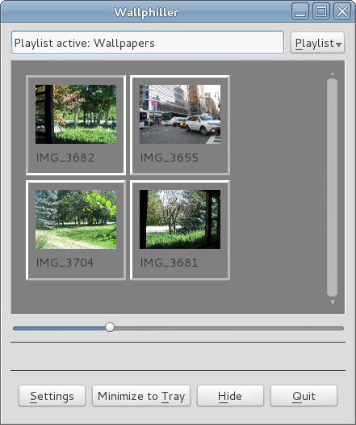

Wallphiller
===========

This tool can change your wallpaper at certain intervals.

Several desktop environments are supported.
Gnome. Mate and Cinnamon are all supported.
Support for Windows has been added as well.
For other environments, a custom command can be defined.

Many desktop environments already have such a feature,
but it's usually very limited.
For example, only one directory may be selected.
Navigating back and forth between wallpapers may
cause the whole rotation to stop.
Sometimes, a directory with thousands of pictures slows down the view
because it's probably busy loading all the previews.
This tool was written to meet the requirements of its author,
who was very annoyed by shortcomings like these.

Wallphiller has a very flexible concept of playlists.
A playlist defines a list of pictures.
This could be a list of picture files or a directory
that contains picture files. If a directory is used, new picture files
will be detected automatically.
It is possible to add multiple directories.
And since most people probably don't have all pictures they've ever taken
in one single directory, but rather categorized in subdirectories,
it's also possible to add a directory recursively (including subdirectories).

Support for additional data sources is planned.

The change interval can be configured as desired, for example in minutes.
Alternatively, it can be changed on startup only, which may be useful
if the user wants to see a new wallpaper everytime he/she logs in.

Build
-----

This software requires Qt 4.8.
Make sure that the QTDIR environment variable points
to your Qt build directory.

Default build:

    $ make

Windows build:

    $ make PLATFORM=win32-g++

Clean up:

    $ make clean

Installation
------------

There is no installation process.
Here are some ideas.

Copy the executable to your bin directory:

    $ cp bin/Wallphiller ~/bin/

Or, to install it system-wide, copy the executable to /opt (as root).

    # mkdir /opt/wallphiller
    # cp bin/Wallphiller /opt/wallphiller/

Wallphiller can't change your wallpaper unless it's running,
so it must be started when you log in.
Use the startup configuration tool provided by your desktop environment
(like gnome-session-properties) to create a start entry for Wallphiller.
Use the `-minimized` option to prevent Wallphiller from showing up
everytime you log in.

    /opt/wallphiller/Wallphiller -minimized

Resources
---------

A working resource file is included (res/res.src).
It is accessed as src/res.cpp, which is a symlink pointing to that file.
It's not necessary to regenerate this file.

Regenerate resource file:

    $ cd res/ && $QTDIR/bin/rcc res.qrc -o res.src

Author
------

Philip Seeger (philip@philip-seeger.de)

License
-------

Please see the file called LICENSE.

